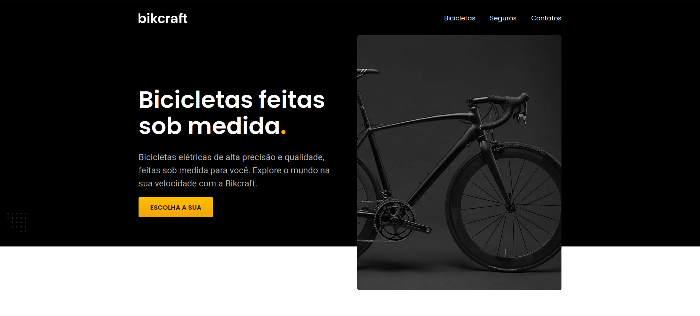
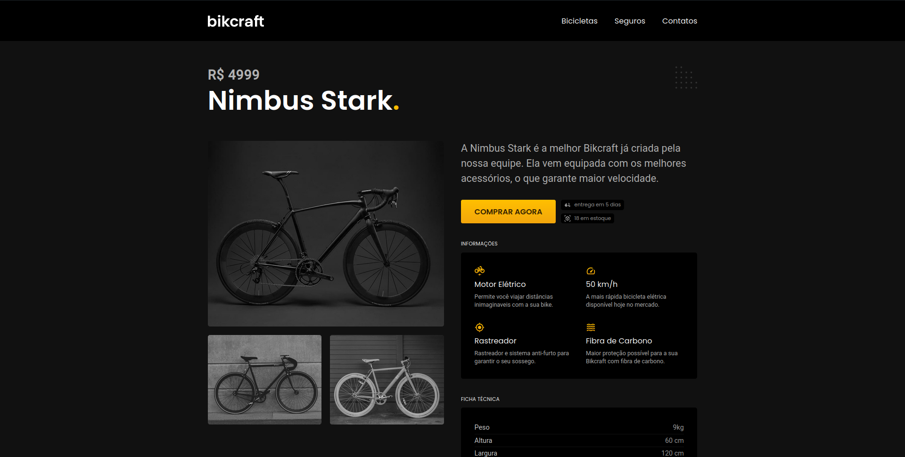

<h1 align="center"></h1>
<h1 align="center"></h1>
<hr>

## About 📚

The **Bikcraft** project was developed during the **HTML and CSS for Beginners** course at **[Origamid](https://www.origamid.com/)**. During the course, all the basics of **UI/UX Design** and **coding** were learned, putting all concepts into practice during the development of this project **Bikcraft**, a fictional company that sells custom bikes custom made.

---

## Important Concepts Used 💼

- **UI/UX Design**
- **Wireframe**
- **Prototyping**
- **Semantic HTML**
- **Optimization**
- **SEO**
- **Google Analytics**
- **Typography**

---

## Technologies Used 🚀

- **HTML**
- **CSS**
- **Figma**

---

## [Demonstration](https://bikcraftio.netlify.app/) 🖥️
[](https://bikcraftio.netlify.app/ "Click to access the project")   

You can access the project by clicking [here](https://bikcraftio.netlify.app/). ✈️

---

## Layout 🔖

The **Bikcraft** project **design** was done using the online **prototyping tool**, **Figma**. The browser file can be accessed below.
- **[Project Design File](https://www.figma.com/file/yvBsdhbJ1aXASmfvaZTDAR/Bikcraft?node-id=0%3A1)**

---

## Getting Started 🔧 

```bash
# Clone the repository
git clone https://github.com/lucasferreiraz/bikcraft.git
# Enter the directory
cd bikcraft
```
After that, use a tool like [Live Preview](https://marketplace.visualstudio.com/items?itemName=ms-vscode.live-server) to create a local server and run the project.

---
<p align="center" style="font-weight:bolder">
    Developed with 💛 by <a href="https://github.com/lucasferreiraz">Lucas Ferreira</a>
</p>